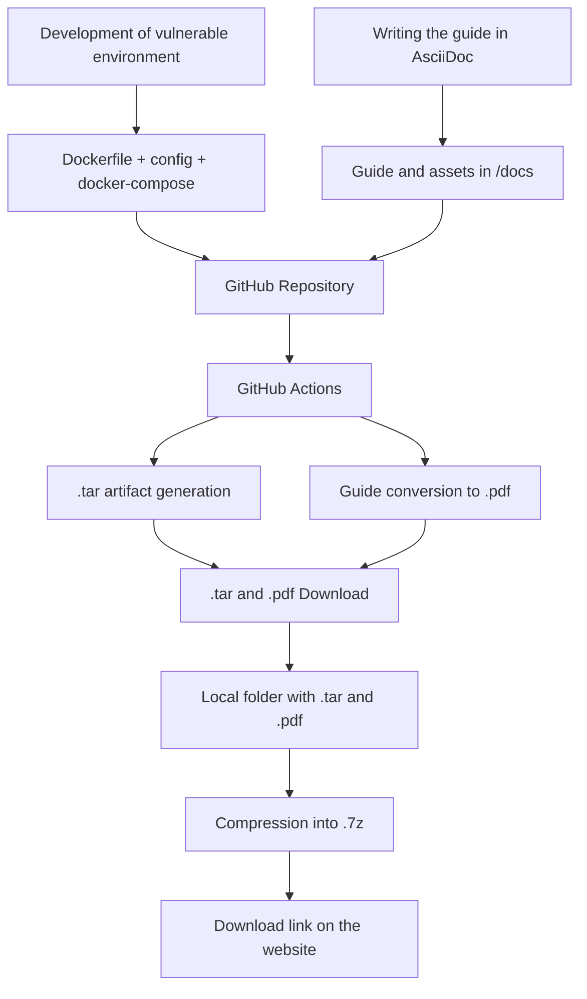

# Proyecto Inferno

**Proyecto Inferno** is a security laboratory designed for both **training and ethical hacking practice**. It is inspired by **Dante Alighieri's Divine Comedy**, and consists of **seven vulnerable machines**, each representing one of the seven deadly sins.

These machines are implemented in **Docker**, exposed as isolated containers, and are designed to demonstrate frequent vulnerabilities in web environments (such as SQL injection, brute force, or code execution) as well as in network services (SSH, FTP, or WordPress).

In addition to the machines, the project provides:

- **A website called Inferno**, which serves as a distribution platform.  
  The application, inspired by Dante's descent into Hell, provides:
  - The **download of each vulnerable machine** in `.tar` format.
  - The **download of a PDF guide**, which details both the attack procedure and prevention measures.
  - An **autodeploy script in Bash**, designed to facilitate the deployment of each container in local environments, without manually configuring Docker.

- **An automated structure**, implemented with GitHub Actions, which:
  - Builds each vulnerable container.
  - Packages them together with their PDF guides.
  - Publishes them as artifacts for use in any laboratory or testing environment.

## Machine Creation

Each of the seven vulnerable machines in Inferno Project follows the same build procedure:

1. **Docker configuration:**  
   First, configuration files specific to each container are created, such as `Dockerfile` or `docker-compose.yml`.  
   This provides a base to install in the container:
   - A **basic operating system**.
   - **Vulnerable services**, such as Apache, Nginx, MySQL, or WordPress.
   - The application or tool you wish to expose for security testing.

2. **Vulnerable content:**  
   Inside each container, vulnerable files are included, such as:
   - PHP applications with SQL injection vulnerabilities.
   - Unpatched WordPress configurations.
   - Security flawed scripting files.
   - Weak FTP or SSH credentials.

3. **Automation with GitHub Actions:**  
   Based on the configuration files in the repository, GitHub Actions:
   - Initializes the Docker images.
   - Packages them into `.tar`.
   - Also generates PDF guides from the AsciiDocs source.

4. **Outcome:**  
   Finally, each vulnerable container, alongside its PDF guide, is available on the Inferno web application for use in laboratory or isolated testing environments.

## Technologies Used

- **Docker and Docker Compose:** Deployment of vulnerable containers in isolation.
- **Nginx / Apache:** Servers used in vulnerabilities.
- **MySQL / MariaDB:** Database backends for various vulnerabilities.
- **WordPress, FTP, SSH:** Services deliberately exposed with weak configurations.
- **Python, C, Bash:** Used for autodeploy and some Proof of Concept or vulnerability components.
- **HTML, PHP, CSS:** Used in designing the vulnerable application.